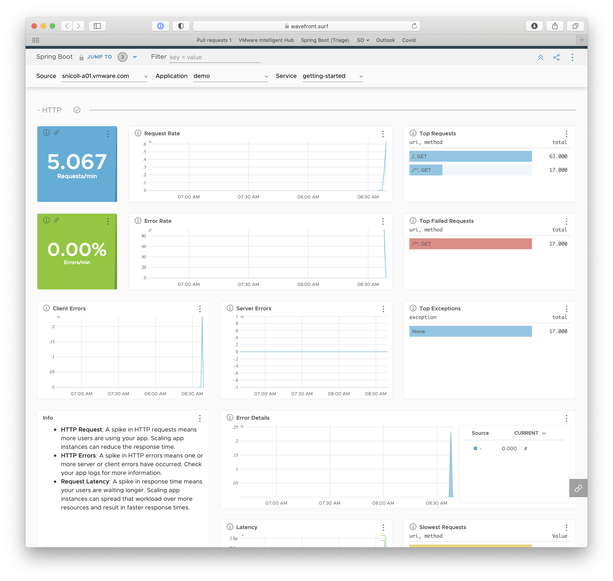

# Getting Started with Tanzu Observability by Wavefront

This guide walks you through your first Spring Boot project with Tanzu Observability by Wavefront.
In this guide, you create a simple web application and configure it to send metrics to a freemium cluster.

## What You Need

* About 15 minutes
* Your favorite IDE
* JDK 1.8 or later

## Start a New Project 

Initialize your using the Spring Initializer:

1. Navigate to https://start.spring.io.
	This service pulls in all the dependencies you need for an application and does most of the setup for you. 
1. Select your favorite build system and language
	> *Note*: This guide assumes you've selected Java

1. Click on **Add dependencies** and select **Spring Web** and **Wavefront**.
1. Click **Generate**. You get a ZIP file, which is an archive of a web application that includes Tanzu Observability.

> *Note*: If your IDE has the Spring Initializr integration, you can complete the steps above from your IDE!

## Out-of-the-Box Observability

Starting this project will automatically send several auto-configured metrics to Tanzu Observability by Wavefront.

1. Before we start the service, let's configure the project so that you can isolate the metrics for it.
		Open `application.properties` and add the following:

		```properties
		wavefront.application.name=demo
		wavefront.application.service=getting-started
		```                                          

		The properties above configure the integration to send metrics to Tanzu Observability by Wavefront using the `demo` application and the `getting-started` service.
		An application can consist of an arbitrary number of services.

1. Run the application from your IDE by invoking the `main` method of `DemoApplication`.
		You see the following:
		```
		INFO 16295 --- [           main] o.s.b.a.e.web.EndpointLinksResolver      : Exposing 2 endpoint(s) beneath base path '/actuator'
		INFO 16295 --- [           main] o.s.b.w.embedded.tomcat.TomcatWebServer  : Tomcat started on port(s): 8080 (http) with context path ''
		INFO 16295 --- [           main] com.example.demo.DemoApplication         : Started DemoApplication in 1.207 seconds (JVM running for 1.727)

		A Wavefront account has been provisioned successfully and the API token has been saved to disk.

		To share this account, make sure the following is added to your configuration:

			management.metrics.export.wavefront.api-token=ee1f454b-abcd-efgh-1234-bb449f6a25ed
			management.metrics.export.wavefront.uri=https://wavefront.surf

		Connect to your Wavefront dashboard using this one-time use link:
		https://wavefront.surf/us/AtoKen
		```

**What Happened?**
* Without any extra information, an account on a freemium cluster was automatically provisioned for you.
* An API token is auto-negotiated for you. 
* To let you access your dashboard, a one-time use link is logged once the application starts. It starts with `https://wavefront.surf`.
	Copy this link on to your favorite browser and explore the out-of-the-box Spring Boot dashboard:


   
> *Note*: It takes a minute for the data to show up.
> Once the data is in Tanzu Observability by Wavefront, make sure the **Application** and **Service** names in the filters match what you configured in the `application.properties` file.   

## Create a Simple Controller

Let's create a simple controller to see how HTTP traffic is automatically instrumented.

1. Alongside the `DemoController` main class, create a `DemoController` as follows:
		```java
		import org.springframework.web.bind.annotation.GetMapping;
		import org.springframework.web.bind.annotation.RestController;

		@RestController
		public class DemoController {

			@GetMapping("/")
			public String home() {
				return "Hello World";
			}

		}
		```

1. Restart the application and trigger `http://localhost:8080` from your browser multiple times.

1. Now, on the dashboard, you'll notice an extra HTTP section.
		This feature is called conditional dashboards and lets you display sections according to a filter.



You can also access `http://localhost:8080/does-not-exist` to trigger a client-side 404 error.

## Accessing your Dashboard using /actuator/wavefront

You can use an actuator endpoint to access your dashboard, without having to look at the logs and get the link every time you start your application. 
To enable this feature, you need to expose the `wavefront` dashboard.

Open `application.properties` again and add the following:

```properties
management.endpoints.web.exposure.include=health,info,wavefront
```

> *Note*: `health` and `info` are exposed out-of-the-box.

If you restart, you can access your Tanzy Observability by Wavefront dashboard by going to `http://localhost:8080/actuator/wavefront`.

## Summary
Congratulations!
You just developed a web application that sends metrics to Tanzu Observability by Wavefront.

# See Also

* [Tanzu Observability by Wavefront for Spring Boot Documentation](https://docs.wavefront.com/wavefront_springboot.html)
* [Try this tutorial to send trace data to Tanzu Observability by Wavefront](https://docs.wavefront.com/wavefront_springboot_tutorial.html)
* [Out-of-the-Box Spring Boot Metrics](https://docs.spring.io/spring-boot/docs/current/reference/html/production-ready-features.html#production-ready-metrics-meter)
  
