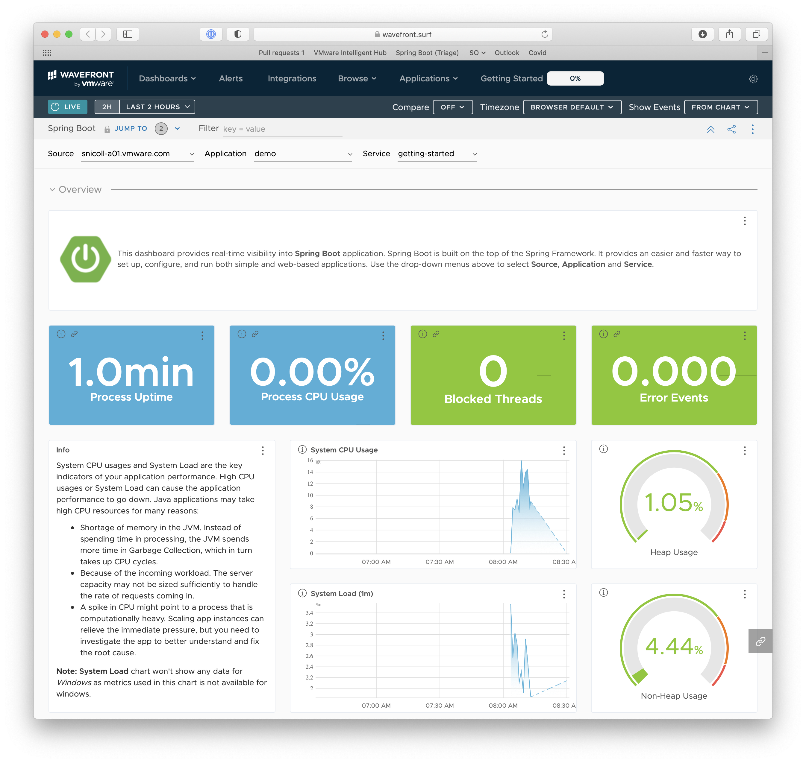

# Getting Started with Wavefront

This guide walk you through your first Spring Boot project with Tanzu Observability by Wavefront.
In this guide, we will create a simple web application and configure it to send metrics to a freemium cluster.

## What You Need

* About 15 minutes
* Your favourite IDE
* JDK 1.8 or later

## Start a New Project 

For all Spring applications, you should start with https://start.spring.io.
The service offers a fast way to pull in all the dependencies you need for an application and does a lot of the setup for you. 

Select your favorite build system and language (although this guide assumes you've selected Java).
Click on "Add dependencies" and select "Spring Web" and "Wavefront".
Once you're done, click on "Generate" which will give you a ZIP archive of a web application including Tanzu Observability.

> *Note*: If your IDE has Spring Initializr integration you can also complete the steps above right from your IDE!

## Out-of-the-Box Observability

Starting this project will automatically send a number of auto-configured metrics to Wavefront.
This happens has you haven't configured an api token for the service yet so one will be auto-negotiated for you.

Before we start the service, let's identify our project so that we can isolate the metrics for it.
Open `application.properties` and add the following:

```properties
wavefront.application.name=demo
wavefront.application.service=getting-started
```                                          

This configures the integration to send metrics to Wavefront using the `demo` application and the `getting-started` service.
An application can consist of an arbitrary number of services.

You can run the app from your IDE by invoking the `main` method of `DemoApplication`.
This should yield the following:

```
INFO 16295 --- [           main] o.s.b.a.e.web.EndpointLinksResolver      : Exposing 2 endpoint(s) beneath base path '/actuator'
INFO 16295 --- [           main] o.s.b.w.embedded.tomcat.TomcatWebServer  : Tomcat started on port(s): 8080 (http) with context path ''
INFO 16295 --- [           main] com.example.demo.DemoApplication         : Started DemoApplication in 1.207 seconds (JVM running for 1.727)

A Wavefront account has been provisioned successfully and the API token has been saved to disk.

To share this account, make sure the following is added to your configuration:

	management.metrics.export.wavefront.api-token=ee1f454b-abcd-efgh-1234-bb449f6a25ed
	management.metrics.export.wavefront.uri=https://wavefront.surf

Connect to your Wavefront dashboard using this one-time use link:
https://wavefront.surf/us/AtoKen
```

What happened?
Without any extra information, an account on a freemium cluster has been automatically provisioned for you.
To let you access your dashboard, a one-time use link is logged at the end of the startup phase, starting with `https://wavefront.surf`.
Copy that link in your favourite browser and explore the out-of-the-box Spring Boot dashboard:


   
> *Note*: it may take a minute for the data to show up.
> Check the values in "Application" and "Service" match what you've configured in `application.properties`.   

## Create a Simple Controller

Let's create a simple controller to showcase how HTTP traffic is automatically instrumented.

Alongside the `DemoController` main class, create a `DemoController` as follows:

```java
import org.springframework.web.bind.annotation.GetMapping;
import org.springframework.web.bind.annotation.RestController;

@RestController
public class DemoController {

	@GetMapping("/")
	public String home() {
		return "Hello World";
	}

}
```

Restart the app and triggers `http://localhost:8080` from your browser multiple times.

Going back to the dashboard, you'll notice an extra HTTP section.
This feature is called conditional dashboards and let you display sections according to a filter.


You can also access `http://localhost:8080/does-not-exist` to trigger a client-side error (404).

## Accessing your Dashboard using /actuator/wavefront

Rather than looking at the logs every time your start the app, you can use an actuator endpoint to access your dashboard.
To enable this feature, the `wavefront` dashboard should be exposed.

Open `application.properties` again and add the following:

```properties
management.endpoints.web.exposure.include=health,info,wavefront
```

> *Note*: `health` and `info` are exposed out-of-the-box.

If you restart, you can access your Wavefront dashboard by going to `http://localhost:8080/actuator/wavefront`.

## Summary
Congratulations!
You have just developed a web application that sends metrics to Tanzu Observability by Wavefront.

# See also

The following may also be helpful:

* [Wavefront for Spring Boot Documentation](https://docs.wavefront.com/wavefront_springboot.html)
* [Out-of-the-Box Spring Boot Metrics](https://docs.spring.io/spring-boot/docs/current/reference/html/production-ready-features.html#production-ready-metrics-meter)
  


